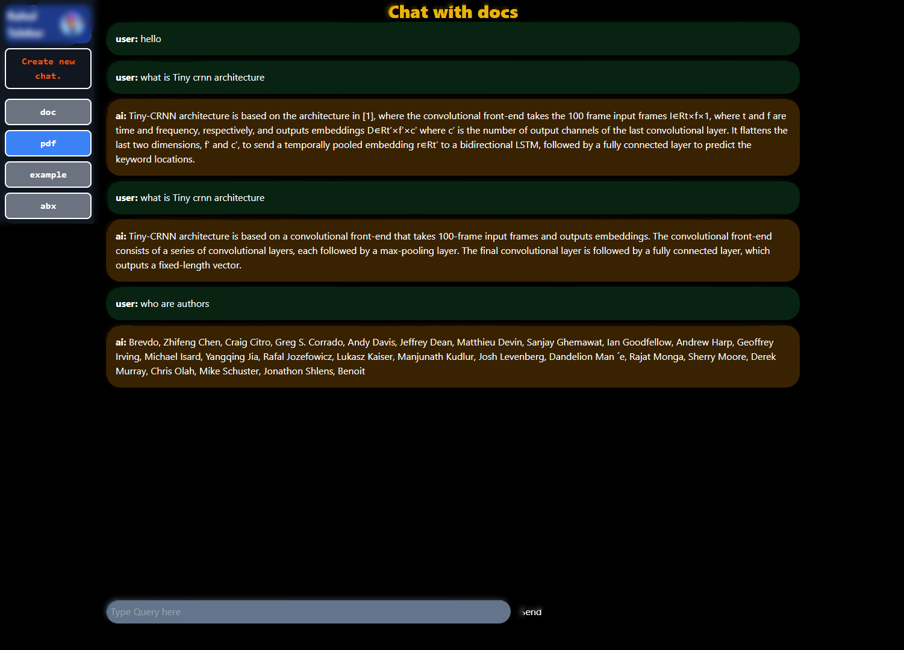

# Chat with Docs

### This is a RAG based application made to question answer with pdf documents.


## Documentation

- It's using React for its frontend part and a flask server for backend part.
- For llm model google's gemini is used with its free api , but any other local llm model can be used with its exposed api.
- User can upload pdf file, for now its only work with text data not images.
- User data is stored  in database for auth and storing previous chat sessions.


## Screenshots




## Run Locally

Clone the project

```bash
  git clone https://github.com/Pix-ez/chat-with-doc.git
```

Before starting first get google's gemini api

Here docker is used to run chromadb instance it need to be setup and change port and api key.


Go to the project directory

```bash
cd chat-with-doc
```

Install dependencies & Start the server

```bash
cd frontend
npm install
npm run start
```
run node server

```bash
cd node-backend
npm install
npm start
```


Start flask server but first install python packages.

```bash
cd flask-server
pip install -r requirements.txt
```

```bash
python app.py
```


## Badges


[](https://choosealicense.com/licenses/mit/)


